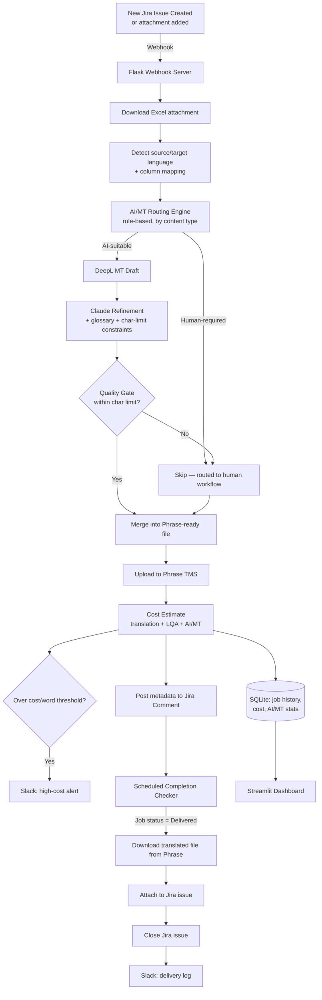

# Jira → Phrase Localization Automation with Hybrid AI/MT Routing

An event-driven pipeline that connects Jira and Phrase TMS, automatically routes game
localization strings between AI/MT translation and human linguists based on content risk,
tracks cost in real time, and reports back into Jira and Slack — built to mirror how a
real localization team's workflow actually runs, end to end.

Built by Inyoung Kim — a Localization Project Manager who applies hands-on automation and
AI/MT skills to build more efficient localization workflows. [LinkedIn](https://linkedin.com/in/inyoungee) · [Portfolio](https://inyoungee.github.io/portfolio/)

---

## Why this exists

Localization teams spend real time on work that doesn't need a human every time: creating
TMS projects, calculating word counts and cost estimates, deciding which strings are safe
for machine translation, and manually closing out tickets once translation is delivered.
This project automates that full loop for a multilingual game localization workflow —
source files span several language pairs (KO↔EN, KO↔JA, KO↔DE, EN↔JA, EN↔FR), with the pipeline
detecting each file's actual source and target language automatically rather than assuming
one fixed pair — while keeping a human in the loop exactly where content risk (narrative
dialogue, rich-text markup, high-priority context) makes that the right call — not everywhere.

## Architecture



## Key Features

- **Event-driven Jira integration** — a Flask webhook listens for new issues and late-added
  attachments (not just issue creation), scoped by JQL to a specific label so unrelated
  ticket types (e.g. LQA-only tasks) are never touched.
- **Hybrid AI/MT routing** — a rule-based engine classifies each string by content type
  (UI, System, Dialogue, etc.) and explicit flags (notes, rich-text markup) to decide
  AI-suitable vs. human-required, rather than translating everything uniformly.
- **DeepL + Claude two-stage translation** — DeepL provides a fast baseline draft; Claude
  refines it with UI context, character-limit constraints, variable/placeholder
  preservation, and per-project glossary terms.
- **Automatic quality gate** — AI drafts that still exceed their character limit after
  refinement are escalated back to human review rather than shipped silently.
- **Real-time cost estimation** — translation, LQA, and AI/MT (DeepL + Claude token) costs
  are calculated and logged per job, with configurable per-language rates.
- **Slack alerting** — high-cost/high-volume jobs trigger a budget-visibility alert;
  delivered jobs log to a separate pipeline channel.
- **Closed-loop completion** — a scheduled checker detects when Phrase marks a job
  Delivered, downloads the completed file, attaches it to the Jira issue, and closes the
  ticket automatically — no manual download/upload step.
- **Streamlit dashboard** — job history, cost breakdown, AI/MT routing split, and a
  per-issue event timeline, reading live from the pipeline's own database.

## Tech Stack

| Layer | Tools |
|---|---|
| Automation / orchestration | Python, Flask, ngrok (dev tunneling) |
| Translation | DeepL API, Anthropic Claude API |
| TMS / PM integration | Phrase TMS REST API, Jira REST API |
| Data | SQLite |
| Dashboard | Streamlit, Plotly, Pandas |
| Notifications | Slack Incoming Webhooks |

## Demo


*(Screenshots / screen recording go here — Jira issue → Slack alert → Streamlit dashboard)*

## Setup

1. Clone the repo and install dependencies:
   ```bash
   pip install -r requirements.txt
   ```
2. Copy `.env.example` to `.env` and fill in your own credentials:
   ```
   JIRA_URL=
   JIRA_EMAIL=
   JIRA_API_TOKEN=
   PHRASE_USERNAME=
   PHRASE_PASSWORD=
   PHRASE_BASE_URL=
   ANTHROPIC_API_KEY=
   DEEPL_API_KEY=
   SLACK_WEBHOOK_URL=
   SLACK_LOG_WEBHOOK_URL=
   ```
3. Run the batch pipeline manually:
   ```bash
   python main.py
   ```
4. Or run the event-driven webhook server (requires `ngrok http 5000` and a Jira webhook
   pointed at the resulting URL):
   ```bash
   python webhook_server.py
   ```
5. View the dashboard:
   ```bash
   streamlit run streamlit_dashboard.py
   ```

## Known Limitations (Deliberate Scope Decisions)

This project intentionally scopes to a single, well-supported case rather than
half-supporting many:

- **Single sheet per source file** — multi-tab workbooks are not parsed; only the first
  sheet is read.
- **Single target language per file is actively processed** — files may contain multiple
  `Target_` columns, but only the first is translated in this version.
- **One Excel attachment per Jira issue** — issues with multiple source files are skipped,
  not partially processed.
- **Rich-text/BBCode markup is flagged, not converted** — strings containing bracket-style
  tags are routed to human review rather than risking silent corruption from an
  unvalidated tag-preserving translation.
- **Completion checking is polling-based, not event-driven** — Phrase doesn't push a
  webhook on job delivery in this setup; a scheduled in-process loop checks periodically
  instead.
- **In-process scheduling** (for both the completion checker and the webhook server)
  is appropriate for a single-instance deployment; a multi-instance production setup
  would need a proper job queue instead to avoid duplicate runs.

## Roadmap

- Full multi-target-language processing (loop the AI/MT layer per language, not just the first)
- Multi-source-file-per-issue support
- Event-driven Phrase delivery callback instead of polling
- BBCode ↔ XML conversion for tag-aware MT

## Engineering Notes

A few debugging findings worth calling out, since they reflect real integration work
rather than a first-try success:

- **Phrase's multilingual Excel import requires explicit column-mapping metadata** —
  without it, Phrase silently imports a file with zero translatable segments rather than
  erroring clearly.
- **A long-running webhook server caches imported modules in memory** — code edits to
  files it has already imported don't take effect until the process restarts, which
  looks identical to a logic bug if you don't know to check for it.
- **Job-level and project-level status in Phrase are independent** — a job can reach
  `DELIVERED` while its parent project still shows `New`; automation needs to check job
  status specifically, not assume the project reflects it.
